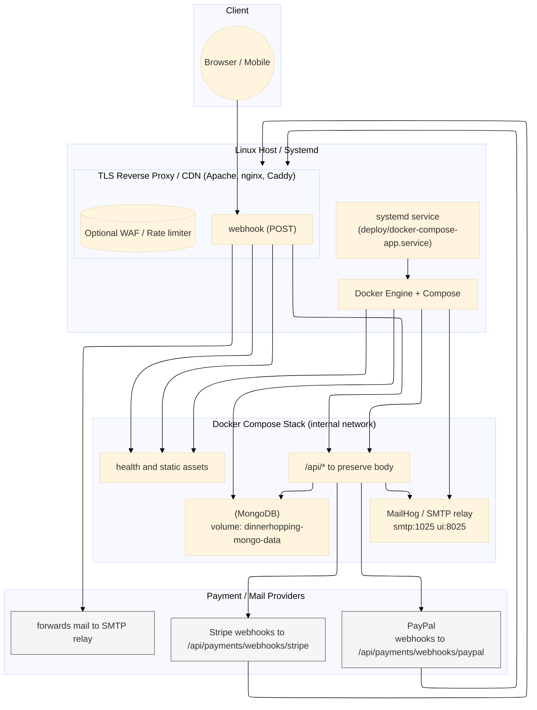

# DinnerHopping Deployment Guide

This document explains how to run the DinnerHopping stack locally and how to deploy it to a Linux server. It complements the high-level overview in `README.md` and should be kept in sync with Compose files and scripts under `deploy/`.



Inbound traffic terminates on your reverse proxy (Apache, nginx, Caddy, etc.), which also serves the static frontend (Apache HTTPD inside the container). Requests under `/api` pass to the FastAPI backend running in Docker; the backend persists data in MongoDB and communicates with Stripe, PayPal, and MailHog/SMTP for payments and emails.

## 1. Prerequisites
- **Docker Engine 24+** with the Docker Compose V2 plugin (`docker compose`) or the standalone `docker-compose` 1.29+ binary.
- **Git** for pulling updates on the target host.
- **mkcert** (optional) to generate locally trusted TLS certificates for development HTTPS.
- Outbound access to Stripe, PayPal, and SMTP endpoints when running in production mode.

## 2. Configuration Files
The Compose stacks read environment variables from the files below. Copy them and adjust values per environment **before** starting containers.

| File | Purpose | Notes |
|------|---------|-------|
| `deploy/backend.env` | Backend runtime configuration | Never commit production secrets. Keep `MONGO_URI` synchronized with the Mongo service name (`mongo`). |
| `deploy/frontend.env` | Build-time variables for the static frontend image | At minimum set `BACKEND_BASE` to the public API URL. |
| `.env` (optional) | Used by Docker Compose for additional overrides | Only needed if you want to centralize values shared by multiple Compose files. |

> The repository includes example values. Replace secrets and hostnames before deploying publicly.

## 3. Running the Full Stack Locally (Developer Workflow)

1. Ensure the sample environment files contain the values you need. Edit them directly or copy them to a secure location and update the `env_file` entries in the Compose files to point to the new paths:
   ```bash
   $EDITOR deploy/backend.env
   $EDITOR deploy/frontend.env
   ```
   You can point `MONGO_URI` to `mongodb://mongo:27017/...` because the dev Compose file provisions Mongo.

2. Start the developer stack from the repository root:
   ```bash
   docker compose -f deploy/docker-compose.dev.yml up --build
   ```

   This launches:
   - MongoDB on `localhost:27017`
   - FastAPI backend on `http://localhost:8000`
   - Static frontend (Apache HTTPD) on `http://localhost:3000`
   - MailHog SMTP capture (`smtp://localhost:1025`, UI at `http://localhost:8025`)

3. Stop the stack when you are done:
   ```bash
   docker compose -f deploy/docker-compose.dev.yml down
   ```

### Local HTTPS + Mail
For instructions on issuing a development TLS certificate and running nginx with MailHog in front of the backend, see `deploy/README-local_mail.md`.

## 4. Production / Staging Deployment

### 4.1 First-Time Server Setup
1. Provision a Linux host with Docker and Git installed.
2. Create the application directory and clone the repository:
   ```bash
   sudo mkdir -p /opt/dinnerhopping
   sudo chown "$USER" /opt/dinnerhopping
   git clone git@github.com:Intership-Germany/DinnerHopping-s-Website.git /opt/dinnerhopping
   cd /opt/dinnerhopping
   git checkout dev
   ```
3. Copy `deploy/backend.env` and `deploy/frontend.env` to secure locations on the server, then edit the values (database credentials, secrets, public URLs, Stripe/PayPal keys, SMTP settings).
4. (Optional) Set up a reverse proxy such as Traefik, Caddy, or Apache to terminate TLS in front of the Docker stack. The bundled frontend container exposes HTTP on port `80`.

### 4.2 Building and Running the Stack Manually
From `/opt/dinnerhopping`:
```bash
cd deploy
# Pull latest images or build with current source
docker compose -f docker-compose.prod.yml build --pull
# Start the services in the background
docker compose -f docker-compose.prod.yml up -d
```

Services exposed by the production stack:
- Backend on `127.0.0.1:8000` (intended to sit behind a reverse proxy)
- Frontend static site on `40332` (customize via `docker-compose.prod.yml`)
- MongoDB on `27017` with data stored in the named volume `dinnerhopping-mongo-data`

To view container logs:
```bash
docker compose -f deploy/docker-compose.prod.yml logs -f backend
```

### 4.3 Automated Updates with `deploy/deploy.sh`
The script handles fetching the latest code, rebuilding/pulling images, and restarting Compose services.

```bash
./deploy/deploy.sh [branch] [systemd_service]
```
- `branch` defaults to `main`; pass `dev` or another branch explicitly if needed.
- `systemd_service` defaults to `docker-compose-app.service`; when provided and enabled, the script delegates restarts to systemd.
- Optional environment variables:
  - `GHCR_USERNAME` / `GHCR_PAT` to authenticate against GitHub Container Registry before pulling private images.
  - `HEALTH_URL` to override the default health-check endpoint executed after the restart (defaults to `https://dinnerhoppings.acrevon.fr/api/openapi.json`).

### 4.4 Installing the Systemd Service
1. Copy the service unit to `/etc/systemd/system/` and update paths if your repository lives elsewhere:
   ```bash
   sudo cp deploy/docker-compose-app.service /etc/systemd/system/docker-compose-app.service
   sudo systemctl daemon-reload
   sudo systemctl enable --now docker-compose-app.service
   ```
2. Ensure the `WorkingDirectory` and Compose file names inside the unit match your setup (for example `docker-compose.prod.yml`).
3. The service runs `docker-compose` as `Type=oneshot` with `RemainAfterExit=yes`, so it keeps containers alive between deployments.

### 4.5 Data Persistence and Logs
- MongoDB data is persisted in the Docker volume `dinnerhopping-mongo-data`. Back up this volume regularly (`docker run --rm -v dinnerhopping-mongo-data:/data -v "$PWD":/backup busybox tar czf /backup/mongo-backup.tgz /data`).
- Backend logs are written to `backend/logs/` on the host and also available via `docker compose logs`. Configure centralized logging in production if required.
- The frontend is static; redeploying rebuilds the image using files under `frontend/public/`.

### 4.6 Payment Provider Webhooks & Platform Access
- Ensure the production host is reachable over HTTPS from Stripe and PayPal IP ranges; do not block inbound webhook traffic at the firewall or reverse proxy.
- Stripe: create a webhook endpoint in the dashboard that points to `https://<your-domain>/api/payments/webhooks/stripe`, subscribe to at least `checkout.session.completed` and `payment_intent.payment_failed`, then copy the signing secret into `STRIPE_WEBHOOK_SECRET` inside `deploy/backend.env`.
- PayPal: register the listener `https://<your-domain>/api/payments/webhooks/paypal` in the PayPal Developer Dashboard, capture the generated webhook ID, and set `PAYPAL_WEBHOOK_ID` (along with `PAYPAL_CLIENT_ID` / `PAYPAL_SECRET`).
- If Stripe/PayPal enforce IP allow-lists or connect apps, grant access to the project account and disable IP filtering for the webhook routes.
- After redeploying, send test events from each provider to verify the backend logs the requests under `backend/logs/payments/` without signature errors.

### 4.7 Static Frontend URL Handling
- The bundled Apache config (`frontend/my-httpd.conf`) redirects `/index.html` to `/` and serves other `.html` pages directly; keep equivalent rewrite rules if you front the container with another proxy.
- When adding new pages, publish them as `*.html` files and link without the extension (for example `/profile` → `profile.html`) so the rewrite keeps URLs clean.
- If you host the static site on an external CDN, replicate the redirect behaviour (302 `/index.html` → `/`) and ensure the CDN allows query strings to pass through unchanged.

## 5. Health Checks
- The backend exposes the OpenAPI document at `/api/openapi.json`. Use it for basic liveness monitoring.
- Stripe and PayPal webhooks are available at `/api/payments/webhooks/stripe` and `/api/payments/webhooks/paypal`; make sure your reverse proxy forwards raw request bodies without modification.

## 6. Troubleshooting
- **Port already in use**: Adjust port mappings (`ports:` entries) or stop conflicting services (e.g., `sudo apachectl stop`).
- **Certificate warnings in dev**: Import the mkcert root CA or trust the generated cert from `deploy/nginx/certs/`.
- **`502 Bad Gateway` from proxy**: Verify the backend container is healthy and reachable at `http://backend:8000` inside the Docker network.
- **Mail not delivered**: In dev, ensure the MailHog container is running; in production, double-check SMTP credentials and firewall rules.

Maintain this guide whenever Compose files, environment variables, or deployment automation change.
